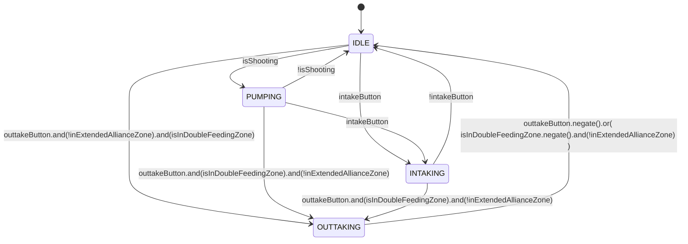

```mermaid
stateDiagram-v2
    [*] --> IDLE
    IDLE --> PUMPING :isShooting
    IDLE --> INTAKING :intakeButton
    IDLE --> OUTTAKING :outtakeButton.and(!inExtendedAllianceZone).and(isInDoubleFeedingZone)
    PUMPING --> IDLE :!isShooting
    PUMPING --> INTAKING :intakeButton
    PUMPING --> OUTTAKING :outtakeButton.and(isInDoubleFeedingZone).and(!inExtendedAllianceZone)
    INTAKING --> IDLE :!intakeButton
    INTAKING --> OUTTAKING :outtakeButton.and(isInDoubleFeedingZone).and(!inExtendedAllianceZone)
    OUTTAKING --> IDLE :outtakeButton.negate().or( isInDoubleFeedingZone.negate().and(!inExtendedAllianceZone) )
```
