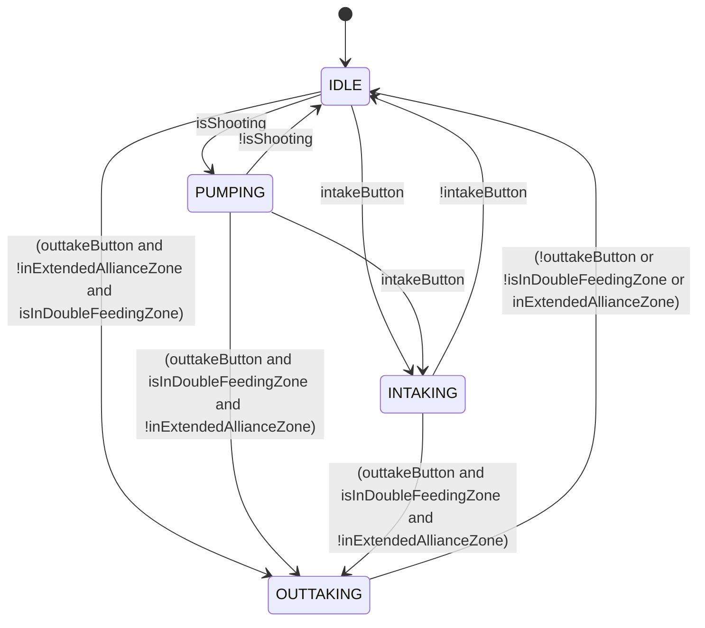

```mermaid
stateDiagram-v2
    [*] --> IDLE
    IDLE --> PUMPING :isShooting
    IDLE --> INTAKING :intakeButton
    INTAKING --> IDLE :!intakeButton
    IDLE --> OUTTAKING :(outtakeButton and !inExtendedAllianceZone and isInDoubleFeedingZone)
    PUMPING --> IDLE :!isShooting
    PUMPING --> INTAKING :intakeButton
    PUMPING --> OUTTAKING :(outtakeButton and isInDoubleFeedingZone and !inExtendedAllianceZone)
    INTAKING --> OUTTAKING :(outtakeButton and isInDoubleFeedingZone and !inExtendedAllianceZone)
    OUTTAKING --> IDLE :(!outtakeButton or !isInDoubleFeedingZone or inExtendedAllianceZone)
```
